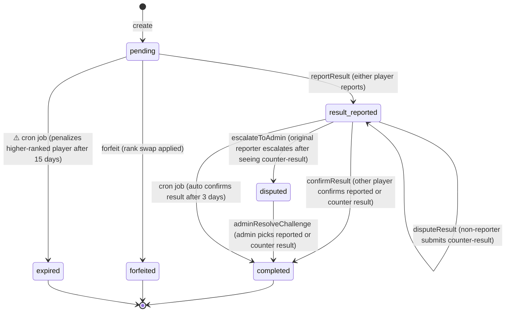

# Challenge Lifecycle

## Statuses

| Status | Meaning |
|--------|---------|
| **pending** | Challenge created, waiting for the match to be played (15-day deadline) |
| **result_reported** | One player submitted a match result, awaiting confirmation from the other |
| **disputed** | Both players submitted conflicting results, escalated to admin |
| **completed** | Result confirmed — rank swap applied (terminal) |
| **forfeited** | A player forfeited during `pending` — rank swap applied (terminal) |
| **expired** | Deadline passed without result ⚠️ *not yet implemented* (terminal) |
| **cancelled** | Defined in schema but *no mutation exists yet* (terminal) |

## State Machine

## Transition Details

### 1. Challenge Creation → `pending`
- **Function:** `create()` in `convex/challenges.ts`
- **Rules:** Pyramid-based only (left neighbor on same row OR same column in row above)
- **Constraints:** One active challenge per player per ranking; both players must be in the ranking
- **Sets:** `expiresAt = createdAt + 15 days` (`CHALLENGE_EXPIRY_DAYS`)

### 2. `pending` → `result_reported`
- **Function:** `reportResult()`
- **Who:** Either the challenger or challenged player
- **Validates:** Tennis scoring rules (best of 3, valid set scores, 3rd set match tiebreak to 10)
- **Stores:** `reportedBy` and `reportedResult` fields
- **Resets:** `expiresAt = now + 3 days` (`RESULT_CONFIRMATION_DAYS`) — confirmation window for the other player

### 3. `result_reported` → `result_reported` (with counter-result)
- **Function:** `disputeResult()`
- **Who:** The non-reporter only
- **Stores:** `counterReportedBy` and `counterResult` fields
- **Limit:** Only one counter-result allowed

### 4. `result_reported` → `completed`
- **Function:** `confirmResult()`
- **Who:** The other player (non-reporter confirms reported result, or original reporter confirms counter-result)
- **Effect:** Applies rank swap, writes `match_result` event

### 5. `result_reported` → `disputed`
- **Function:** `escalateToAdmin()`
- **Who:** Original reporter, after seeing a counter-result they disagree with
- **Effect:** Awaits admin decision

### 6. `disputed` → `completed`
- **Function:** `adminResolveChallenge()`
- **Who:** Admin user
- **Effect:** Admin picks either "reported" or "counter" result; applies rank swap; writes `match_result` event with `adminResolved: true`

### 7. `pending` → `forfeited`
- **Function:** `forfeit()`
- **Who:** Either player involved in the challenge
- **Effect:** Forfeiting player loses; rank swap applied; writes `match_result` event with `isWalkover: true`

### 8. `pending` → `expired`
- **⚠️ NOT YET IMPLEMENTED**
- **Trigger:** Scheduled cron job checking `expiresAt < now()` via `by_status_and_expiresAt` index
- **Effect:** Higher-ranked (challenged) player drops 1 rank; writes `challenge_expired` event
- **Configurable:** `clubSettings.penaltyOnExpiry` controls whether penalty is applied

## Rank Swap Logic

When the **lower-ranked player wins**: they take the higher-ranked position, the loser and everyone between shift down by 1. When the **higher-ranked player wins**: no position change occurs.

## Key Constants

- **Challenge expiry (pending):** 15 days (`CHALLENGE_EXPIRY_DAYS`)
- **Result confirmation window:** 3 days (`RESULT_CONFIRMATION_DAYS`) — `expiresAt` is reset when a result is reported
- **Active statuses** (block new challenges): `pending`, `result_reported`, `disputed`
